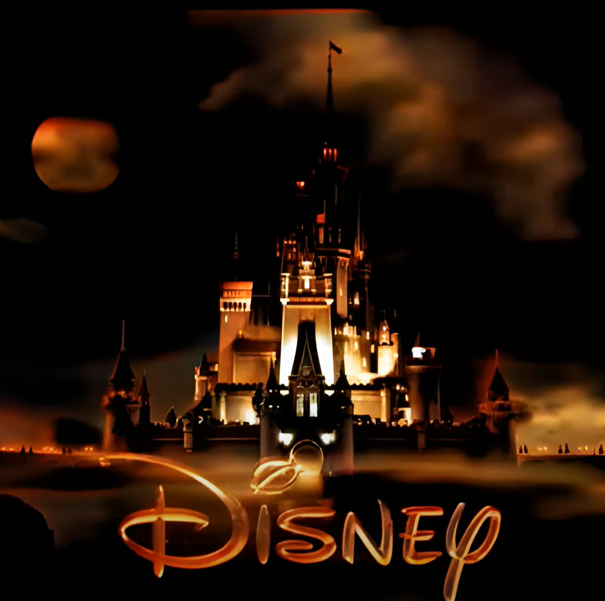

# Video Restoration Pipeline

**Video Restoration Pipeline** is a video restoration tool that works with Docker Compose and multiple Python AIs. Fully compatible with Windows, it allows you to use your GPU (through WSL2) and is very easy to use once fully installed.

## Prerequisites

- **Docker**: [Docker Desktop](https://docs.docker.com/desktop/gpu/) should be installed and configured to use WSL2 by default.
- **Python 3.7 or newer**: Only the `pyyaml` library is needed.
- **NVIDIA CUDA TOOLKIT 12.1 or older**: Follow the [instructions here](https://developer.nvidia.com/cuda-toolkit).
- **Windows 10**: It should work with Windows 11 as well.
- **Disk Space**: Ensure you have at least 45 GB of disk space.

## How to Use

1. **Create a Docker Image for each AI you want to use**:
   - Navigate to the `services` folder in the repository. Each subfolder represents a Docker container for a specific task.
   - Follow the instructions in each folder to set up a Docker image:
     - `services/deoldify`: Dockerfile and setup instructions for DeOldify (color restoration).
     - `services/esrgan`: Dockerfile and setup instructions for Real ESRGAN (resolution increment).
     - `services/style_transfer`: Dockerfile and setup instructions for Video Style Transfer.
     - `services/rife`: Dockerfile and setup instructions for video interpolation.

2. **Modify `config.yml`**:
   - Edit `config.yml` to specify which AIs to include in your Docker Compose setup and set any necessary environmental variables. The default configuration is fine for the first try.

3. **Run `python setup.py`**:
   - This script will read the `config.yml` file and create a `docker-compose.yml` file based on your configuration.

4. **Place your input video**:
   - Place the video you want to process in the `video/source` folder.

5. **Run Docker Compose**:
   - Execute `docker-compose up` to start the pipeline.

6. **Check the result**:
   - Go to the `video/result` folder to view the processed video.

## Example

### Input Video

1. Put this video in the `video/source` folder.
2. Customize `config.yml`, set all AIs to true except from style transfer.
3. Run `docker-compose up`.
4. Check the result in the `video/result` folder.

The entire process took 20 minutes with a Nvidia 3090 GPU for a 32 seconds long video.

### Result Video

## Other Examples
Other interesting before vs after examples will be added in this section.

## Contributors

If you're interested in contributing to this project, feel free to fork the repository and submit pull requests. Issues and feature requests can be made via GitHub.

## License

This project is licensed under the MIT License.

## Contact Information

For issues or support, please use the GitHub channels.
